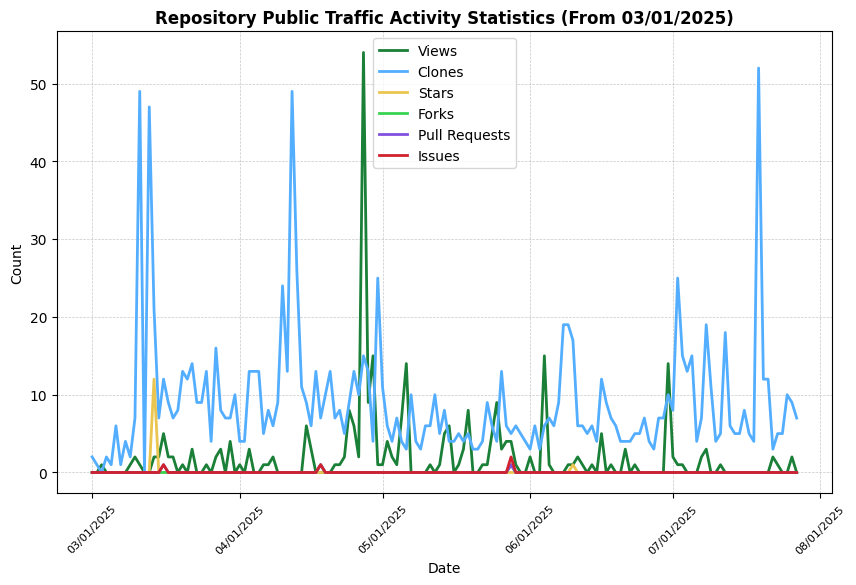

 

The following are examples of completed `.git` university projects, many involving extensive collaboration. 
Offering as much as 15 ECTS (0.25 EFTS), they cover a diverse range of IT disciplines. 
These include all undergraduate computer science (COSC), software engineering (SENG), 
embedded and computer systems (ENCE), relevant engineering (BE),and GIS (part of GEOG) credits 
given at my home university or in advanced equivalence from exchange studies abroad, 
with much more at postgraduate-level in software engineering, embedded systems, 
& computer & other advanced data engineering & sciences.

- Distributed real-time system for global semi-autonomous asynchronous robotic depot storage
- Wide-area wireless embedded networking system for low-power autonomous wildlife surveillance
- Configurable software design & cross-platform prototyping of multiple use-case match algorithm
- BDD/TDD vehicle registration app, requirements engineered seamless E-commerce art gallery web app, etc & QA
- Microcellular image analysis & ResNet & U-Net classifying diagnosis & treatment, & XAI
- Low-level parallelisation of graphically heat-mapped, collision-free pedestrian crowd simulation
- Distributed parallelisation of a malaria endemic stochastic simulation algorithm using Monte Carlo
- Bayesian probabilistic ML modelling of sport match data for predicting ranking using MS Trueskill
- Deep reinforcement learning for dynamic job shop scheduling optimisation with Stable Baselines 3
- UX-driven real-time interactive multi-sensory empathetic humanoid AI-agent using CNN & LLM
- Interrupt-driven, real-time remote helicopter state, orientation & operation controller using PWM
- Simulating XYZ TCP/UDP socket communication, LP flow optimization & dynamic RIP networking
- Monopoly, kalah, embedded interactive MP memory, AI quarto, RL Snake & Pong, React board, FP soduko, etc games
- Parking, rego, supply chain, auction, bar, itinerary route planner, forum, etc. (G)UI apps of varying FW
- 3D-animated scenery & interactive gameplay with ray tracing, particle system & real-World physics
- Cross-platform application prototype for streamlining offshore-focused maritime mooring planning
- and much more, to be listed soon, not to mention other projects completed without using `.git`

### 📈 Repository and User Contribution Statistics

Regularly generated visualizations of my personal GitHub statistics exclusive to university projects:

    
>  _My **Avg contributions** applies to uni projects only in `.git` collaborative context, excluding open-source, lead, work etc_

🤓 Fun fact: I initially deployed the visualisations these succeed 1 month before a then unknown project including CI/CD automating GitHub statistic visualisations (though not using GitHub workflows) for the 1st instance of an advanced data engineering course. Unfortunately, following multiple hands-on private teaching by example, someone else pushed the API-fetching task before me and any remote deadline, regardless of thorough planning and all project management documentation. Not the 1st instance of finding a project I have deployed to GitHub as an assessment the following (or later the same) period, & not the 1st time I have found myself experiencing difficulties in, or - another fun fact - working on the course after. Thus, & for countless reasons more, most `.git` repositories are private.

<!--REPO_ACTIVITY_STATS_START-->

<!--REPO_ACTIVITY_STATS_END-->
